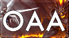

#  Development Guide

Updated 2017-12-05

## Introduction

This is your new reference guide for the development of custom games written by the OAA development team. During the development of OAA we are constantly learning new and more complex modding techniques like making custom models, animations, menus, etc. and here is where you will find in-depth guides, examples, case-histories, and other useful files made by us and also links to other great resources by Valve, Moddota, and more!

A note to aspiring authors and subject-field experts who wish to contribute their knowledge: we strongly encouraged you to PR new documents here (be sure to link it in the department's README)! If something is out of date feel free to comment on it or PR any changes for review! Thanks, and happy modding!

## Table of Contents

1. [Setup][1]

2. [OAA Development Discord][2]

3. [Git][3]

4. [Dota 2 Tools][4]

5. [Dota 2 Addon Manager][5]

6. [KV][6]

7. [Sound][7]

8. [Map][8]

9. [Materials][9]

10. [Models][10]

11. [Particles][11]

12. [Icons][12]

13. [Lua][13]

14. [Panorama][14]

15. [Design][15]

16. [Balance][16]

17. [Bug-Reports][17]

18. [Documentation][18]

19. [Writing][19]

20. [Translation][20]

21. [Tournament][21]

[1]: setup/README.md
[2]: discord/README.md
[3]: git/README.md
[4]: dota2tools/README.md
[5]: d2am/README.md
[6]: kv/README.md
[7]: sound/README.md
[8]: map/README.md
[9]: materials/README.md
[10]: models/README.md
[11]: particles/README.md
[12]: icons/README.md
[13]: lua/README.md
[14]: panorama/README.md
[15]: design/README.md
[16]: balance/README.md
[17]: bug-reports/README.md
[18]: documentation/README.md
[19]: writing/README.md
[20]: translation/README.md
[21]: tourney/README.md
