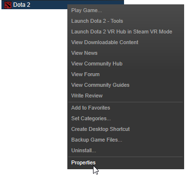
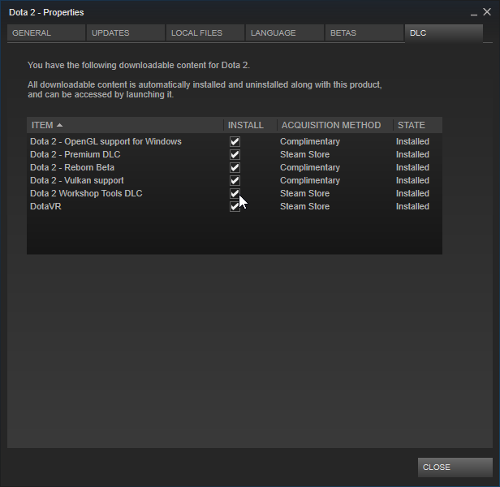
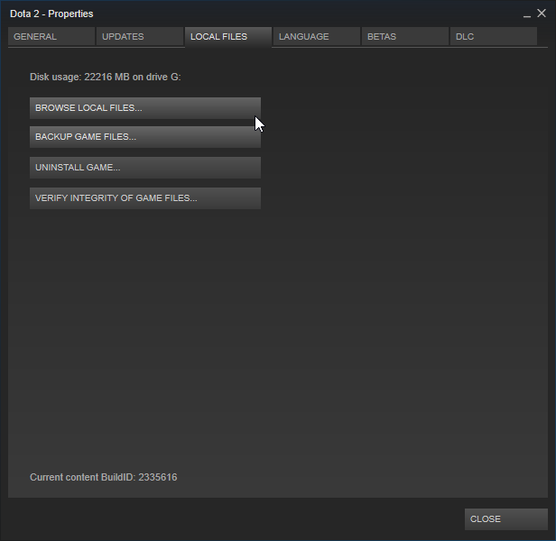
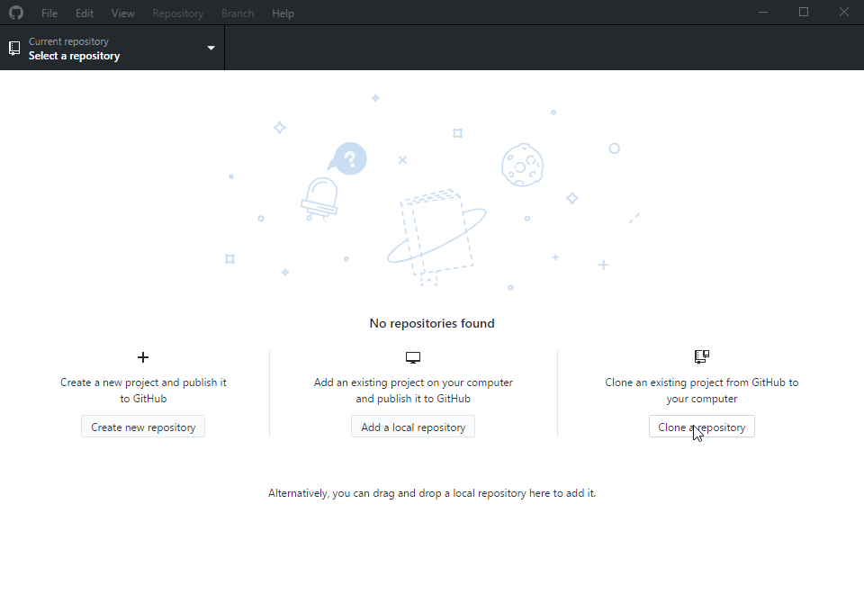
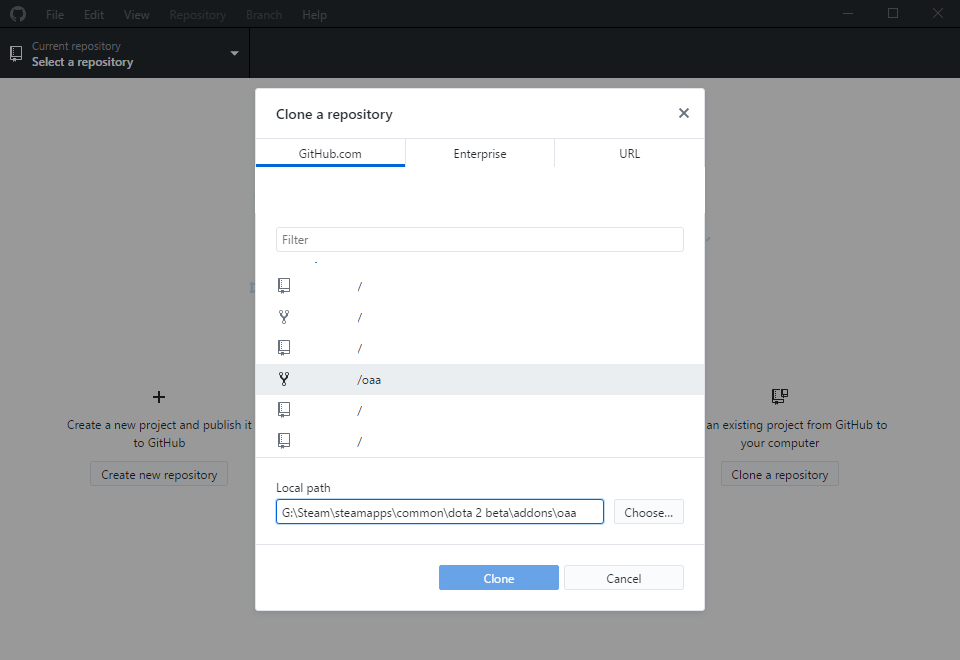
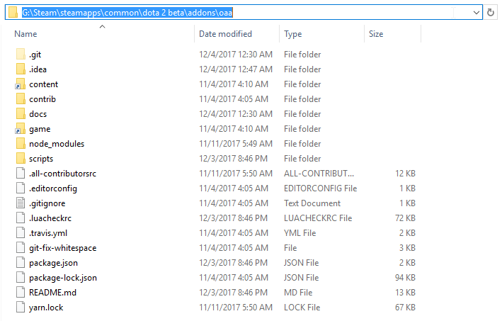
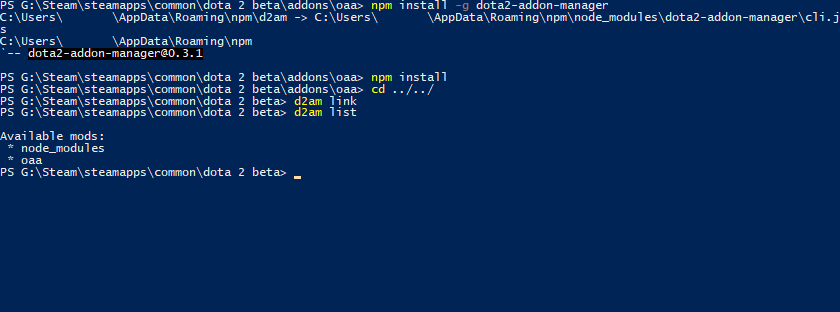
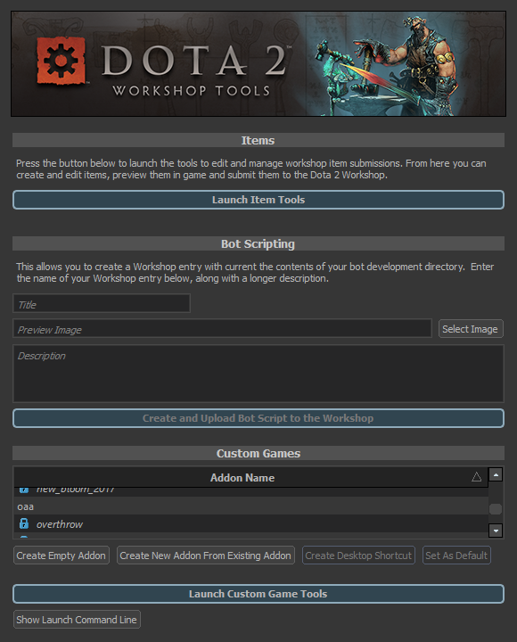

# Installing Open Angel Arena

Updated 2018-03-22

[< Setup][0]

For ease of navigation, the installation is broken up into sections and can be jumped to by clicking any of the links below.

1. [Required Software](#required-software)
2. [Installing OAA](#installing-oaa)
3. [Manual installation of OAA (For CLI users or people who cannot get d2am working correctly)](#manual-installation-of-oaa)

## Required Software

#### 1. **[Steam](http://steampowered.com)**
#### 2. DOTA 2 Workshop Tools
- From within steam, right click on `Dota 2` and select `Properties` at the bottom
  
- Go to the DLC tab of the window that pops up
- Check the `INSTALL` box next to `Dota 2 Workshop Tools DLC`
  
- It will download once you close that window (This can take a bit)
#### 3. [GitHub client OR GitHub CLI](http://desktop.github.com/)
#### 4. [NodeJS](http://nodejs.org)
#### 5. [Sublime Text 3](http://www.sublimetext.com/) (Or any other text editor that supports `.editorconfig`)
- The plugin for sublime can be found [here.](https://github.com/sindresorhus/editorconfig-sublime)

## Installing OAA
### Find where the DOTA 2 beta is installed

The DOTA 2 beta (Normal and Test/Tools clients) are found in the same menu as mentioned in the required software section for the DOTA 2 Tools client [Linked here for your convenience](#2-dota-2-workshop-tools).  Instead of going to `DLC`, however, head over to `Local Files` and click on `BROWSE LOCAL FILES...`.

  
  
  
  
COPY THIS PATH!  You MUST know where your DOTA 2 installation is in order to clone the repository locally later and to run the initial setup commands.  **DO NOT ASSUME THE SHOWN PATH IN THE IMAGE IS CORRECT!**

### Clone Open Angel Arena into the addons folder

IMPORTANT: You are not cloning the public OpenAngelArena/OAA repository. For the following step you are cloning YOUR OWN fork of that repository. If you have not already done this do not continue until you have (see the following section on "Forking" in the  guide.
- Launch your GitHub Client (And log into it)
- Click `Clone a repository`
  
- Select your Open Angel Arena fork and be sure to set the `Local Path` to where your DOTA 2 beta folder is (And in the addons directory)
  
- Click `Clone` and let the process complete

### Open Up Command Prompt (PowerShell will also work and is preferred if you can use PowerShell)

- NOTE: If your DOTA 2 client is NOT installed on your default drive (Usually `C:\`), then start by running the following command `G:` Where `G` is replaced by the drive letter you need to change to.
- Run the following in your command prompt (Or PowerShell).
  - `cd "SOME_PATH"` Where `SOME_PATH` is replaced by the location where Open Angel Arena was cloned to
  
  
  
- Once in the correct directory, run the following commands IN ORDER
  - `npm install -g dota2-addon-manager`
  - `cd ../../` (This gets you into the base `dota 2 beta` directory)
  - `d2am link` (This will write to the console some, that is normal.  The screenshot shows nothing due to circumstances outside of the normal installation)
  - `d2am list`
  - `cd "SOME_PATH"` Where `SOME_PATH` is replaced by the location where Open Angel Arena was cloned to
  - `npm install` (This command can take a bit to run, please be patient)
  
  

### Add required DLL

Two methods of getting the proper DLL

- A. Compiling
  - Download the source code for [mpg123](https://sourceforge.net/projects/mpg123/files/mpg123/1.23.8/)
  - Unpack the tar.bz2 file, open that directory and run `makedll.sh`
  - When this completes, open the `build` directory and find the `libdll123-0.dll` file.

- B. Download from us
  - If you're lazy and want to get going fast, download the file from [this repo](https://github.com/OpenAngelArena/oaa/blob/master/libs/libmpg123-0.dll)

- After you have the DLL, Go back to your `dota 2 beta` directory, and place this DLL file into `game/bin/win64`.

### Check tools mode

- Go into `Steam` -> `library` -> `games` -> `DOTA 2` (This is the same menu you have used for getting to the properties to install the tools client)
- In that right click menu NEAR THE TOP, is `Launch DOTA 2 - Tools`.  Click this option
- If all of the above installation has worked, you should see the Open Angel Arena directory name without a lock next to it in the custom games selection

  

## Manual installation of OAA
### CLI installation

This portion of the documentation assumes that you already know where to put the repository and that you know enough to set up git CLI.  As a result, the specifics on how to use the credential management system within Git or access tokens are **NOT** going to be covered.  There is also no accommodation to installing Git CLI for global use on your system, as that is also expected to have already been done for this process.

The following steps are assumed to be run IN ORDER!

- Inside of where your DOTA 2 installation is, go into `addons` and create a folder (This will be where your repository will be, for the sake of this documentation, we will assume the folder name is `oaa`)
- Open up a command prompt (Administrative privileges are generally not needed, but be aware of how to handle this is your system configuration demands elevation)
- Run `cd "SOME_PATH"` Where `SOME_PATH` is replaced by the location of your DOTA 2 installation
- Run `cd ./addons/oaa/`
- Run `git init`
- Run `git clone {Your Fork URI}` (This can take a bit, please be patient)
- `npm install -g dota2-addon-manager`
- `cd ../../` (This gets you into the base `dota 2 beta` directory)
- `d2am link` (This will write to the console some, that is normal.  The screenshot shows nothing due to circumstances outside of the normal installation)
- `d2am list`
- `cd ./addons/oaa/`
- `npm install` (This command can take a bit to run, please be patient)

### Manual linking (If `d2am link` failed)

This part assumes you ALREADY have the command prompt to your DOTA 2 addons directory.  This also assumes you know where your repository was cloned to and can open up the file explorer there.  Creating the hard links USUALLY requires administrative privileges, so please be aware of how to launch a command prompt as an administrator.

**DO NOT DO THIS UNLESS YOU HAVE ISSUES WITH D2AM LINK AND PLEASE CONTACT THE DEVS ON DISCORD BEFORE TRYING THIS.  There are many issues that can be resolved with simple fixes if D2AM is failing before trying to make these hardlinks manually.**

- Open up your file explorer and delete the following folders from your repo if they exist: `content` and `game`.  These folders will be replaced by hard links.
- Go over to your command prompt and do the following IN ORDER.
- `cd C:\Windows\System32` (Yes, I know this isn't where OAA is, but you cannot normally make links from anywhere else)
- `mklink /J "{PATH_TO_OAA_REPO}/content" "{PATH_TO_DOTA_ADDONS}/oaa/content"` Where `PATH_TO_OAA_REPO` the the full SYSTEM path to the OAA repository directory.  Where `PATH_TO_DOTA_ADDONS` is the `content/dota_addons` directory in your DOTA 2 installation folder
- `mklink /J "{PATH_TO_OAA_REPO}/game" "{PATH_TO_DOTA_ADDONS}/oaa/game"` (See above for references)

[0]: README.md
